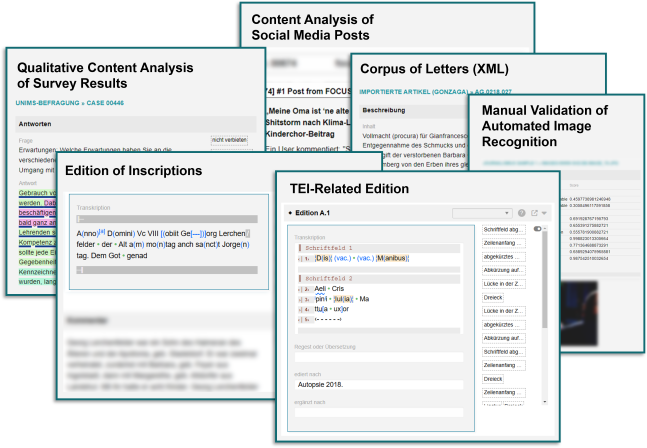

# Epigraf

Epigraf is a research platform for collecting, annotating, linking and publishing multimodal text data.
The data model supports research databases ranging from epistolary editions to social media corpora.
Epigraf is currently used primarily for editing epigraphic data - inscriptions in connection with the objects to which they are attached.
It includes a publication system for various document formats such as Word or TEI, structured JSON, XML and CSV data, and triples in TTL, JSON-LD and RDF/XML.
See the [user documentation](https://epigraf.inschriften.net/help)
and the [developer documentation](https://digicademy.github.io/epigraf/) for further information.

Epigraf has a history.
You will find archeological layers and legacy code from former development epochs
when visiting the code base and documentation.
Some of them are well preserved, others are deteriorating.
In any case, they provide fertile soil for future development.
Look out for the flowers that are in bloom and help nurture the garden.

**Want to try it out?** Contact us for a test account on one of our machines.




## How to run Epigraf

1. Fire up the Apache Webserver, the PHP container, and the database container
   ```
   docker compose up -d
   ```

2. Install Epigraf
   ```
   docker exec epi_php composer install
   docker exec epi_php bin/cake cache clear_all
   ```

3. Init the database and add an admin user
   (with role, password, and access token set to `admin`)
   ```
   docker exec epi_php bin/cake database init --drop
   docker exec epi_php bin/cake user add admin admin admin admin
   ```

4. Create an example project database from a preset
   ```
   docker exec epi_php bin/cake database init --database epi_example --preset movies
   ```

5. Login to Epigraf at http://localhost with username and password `admin`.

What's next? Get familiar with the [Epigraf configuration](https://epigraf.inschriften.net/help) to adapt it to your use case.
Have a look at the [docker](docker) folder for more options for running Epigraf.
See the [developer documentation](https://digicademy.github.io/epigraf/) for background information.

## Authors and Citation
Epigraf is developed by the
[Digital Academy of Sciences and Literature | Mainz](https://www.adwmainz.de/digitalitaet/digitale-akademie.html)
and the research group
[Digital Media & Computational Methods at the University of Münster](https://www.uni-muenster.de/Kowi/institut/arbeitsbereiche/digital-media-computational-methods.shtml), Germany.

**Citation**

Jünger, J., Hertkorn, G., Gärtner, C.,
Herold, J., Knispel, J., Kopp, M.,Kotthoff, H., Lentge, F., Michel, M., Syring, W-D. (2024).
Epigraf: a research platform for collecting, annotating, linking and publishing multimodal text data.
Version 5.0. https://github.com/digicademy/epigraf
