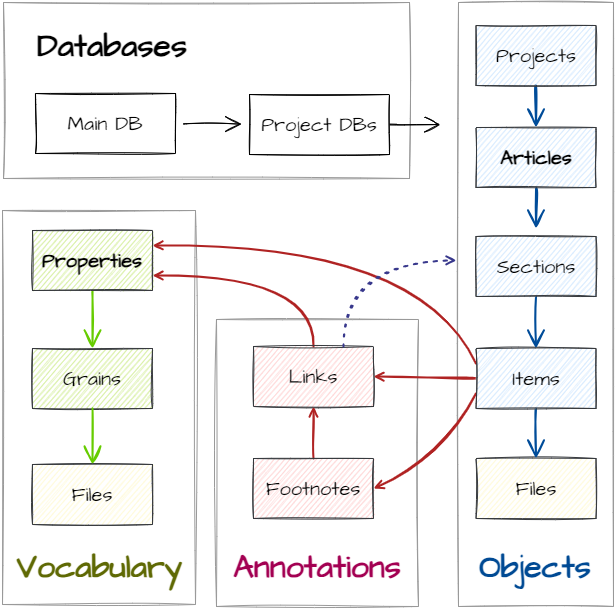

## Application Database

The application database `epigraf` holds data that is independent of any specific project.
The tables include:

- *databanks*: The configured project databases.
- *users*: User data, including contact information and settings
- *permissions*: User permissions, see [Authentication and authorization](/backend/controller/#authentication-and-authorization).
- *files*: Metadata for files managed by Epigraf.
- *docs*: Wiki, help and public pages.
- *pipelines*: Export pipeline configurations.
- *jobs*: Each [batch operation](/database/batch-operations) generates a job.

## Project Databases

Each project has its own database, prefixed with `epi_`.
The project databases include the following tables:

- *projects*: A project groups articles together, for example the articles of a volume.
- *articles*: An article contains data organized in metadata and *sections*.
- *sections*: A section is part of an article and contains data
  organized in *items*. Sections can be nested.
- *items*: An item is a unit of information within a section. It contains
  fields for data (text, values), references to properties, or
  references to articles or sections.
- *footnotes*: Text fields (*items*) can contain footnotes (notes and critical
  apparatus). Footnotes are placed as tags in text fields and assigned an
  ID. The content can be found under this ID in combination with the name of
  the table and the field in the *footnotes* table.
- *links*: Text fields (items) can contain annotations, i.e. tags with a link to
  *articles*, *sections*, *properties*, and *footnotes* and other attributes.
  The links table contains a record for each tag, linked by the tag ID, field name,
  table name and table ID.
- *files*: Files are stored in the file system and mirrored in the database.
- *properties*: Properties contain supporting data and vocabularies. Properties are organized
  hierarchically. For example, a property can be a place name or a category for content analysis.
- *notes*: Notes contain pages used for collaboration and documentation in a team.
- *types*: The configuration of the domain model, including article types and available fields.

See the user help for further information about the available fields in each table.

## Domain Model Configuration

After creating a new project database, it should be configured.
The configuration is stored in the `types` table for each project database and,
for example, includes field labels.

In the database, project, article, section, item, footnote, link and property records have a type field
connected to the configuration. In the types table, the `scope` corresponds to the table name
and the `name` to the specific type.

The configuration is stored in JSON format in the `config` field.
See the user help for further information about configuring the domain model.
