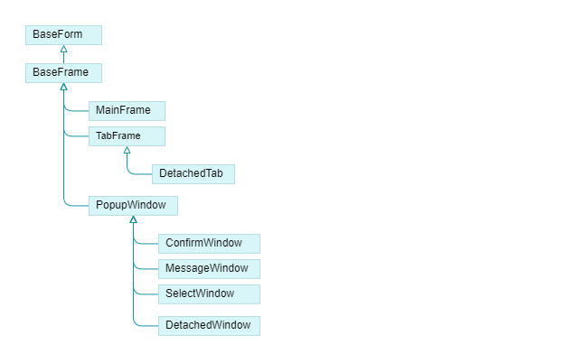
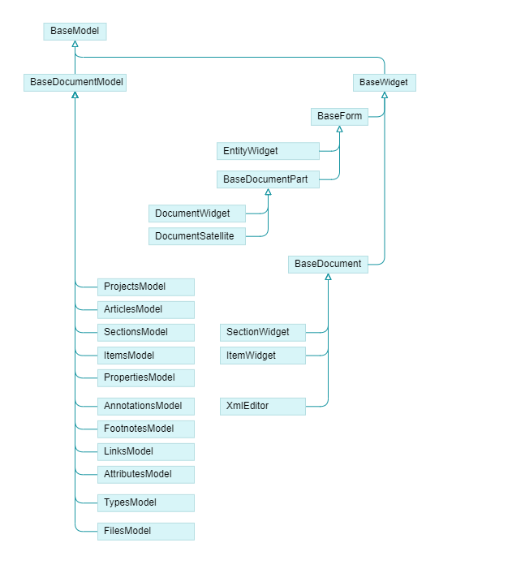

Epigraf uses a widget system to connect HTML elements with JavaScript classes.
The widget HTML elements are generated in the [backend](/devel/backend/view) by helper classes derived from CakePHP helpers.

Each JavaScript widget class registers a CSS class and the framework instantiates and attaches the widget classes
to the found elements. For example, a table with the class `widget-table` is supplemented by a `TableWidget` class.
Widgets do not exclude each other, one HTML element can be attached to multiple widget instances of different classes.

*Note:* The widget system is in an early experimental development stage.
The documentation does not cover all aspects yet and is subject to change.

## The EpiWidJs Framework

The base classes of the framework are defined in `htdocs/js/base.js`:
- **BaseModel**: The `BaseModel` class provides lifecycle functions and methods to attach event listeners.
  Model class instances are not necessarily connected to the DOM.
  They are used to create a frontend model layer as a complement to the backend model layer.
  A model can have a parent and multiple children, the first constructor parameter is the parent model
  (which may be undefined for top level models).
- **BaseWidget**: All widgets derive from the `BaseWidget` class, which itself derives from `BaseModel`.
  A widget is defined as a model class instance attached to the DOM.
  The first constructor parameter is the HTML element to which the widget is attached,
  followed by a widget name and the parent class.
- **BaseForm**: The `BaseForm` class derives from `BaseWidget` and is a widget attached to form elements.
  It is used for form handling, preparing input to the database.
- **BaseDocument**: The `BaseDocument` class derives from `BaseWidget`. It is used for document handling.
  A document consists of several parts such as sections, footnotes and notes.
  Document classes hold together the different parts and manage the interaction between them.


### The Widget Life Cycle

There are two types of widgets: global and scoped. Global widgets include widgets that are responsible
for the entire page and usually occur only once per page, such as `MainFrame` (main content of the page),
`ResizableSidebar` (for the two main sidebars) or `ScrollSync` (for synchronizing scrollable main content of
pages and the table of contents). Scoped widgets are usually attached to specific HTML elements, for example
to a table widget, and can occur multiple times on a page. The majority of widgets belong to the second category.

All widgets are initialized in the `widgets.js` file.
The global widgets are initialized first in `initApp()`, followed by the scoped widgets in `initWidgets()`.

Scoped widgets are registered with their CSS class name at the end of their widget class file.
For example, by registering the `TableWidget` class with the 'table' key, for all HTML elements
with the class `widget-table` a `TableWidget` is instantiated and attached to the DOM element:

```js
window.App.widgetClasses = window.App.widgetClasses || {};
window.App.widgetClasses['table'] = TableWidget;
```

The widget lifecyle is managed by methods that may be overwritten in derived classes.

1. **constructor**: The constructor is called with the DOM element in the first parameter
   and saves the reference to the DOM element in the `widgetElement` property.
2. **initWidget**: The method contains initialization code.
   It is called once after all widgets were constructed and are ready to be used.
   This is the place where widgets can safely initialize functionality that depend on other widgets.
3. **updateWidget**: The method is usually called by the widget itself if the DOM content of the widget element changed.
   This is the place where event listeners are updated by the widget.
4. **clearWidget**: The method is called when the widget element is about to be removed (like a destructor).
   It removes all event listeners, child models, and detaches the widget instance from the DOM element.

The lifecyle methods are triggered by two key events:
- The `epi:init:widgets` event triggers the `onInitWidgets()` method
  after all widgets connected to a DOM element or its descendants were instantiated,
  whether on the first page load or on later page updates by AJAX calls.
  It calls `initWidget()` if the widget was not already initialized.
- The `epi:clear:widgets` event triggers the `onClearWidgets()` method when DOM element are about to be removed,
  for example when replacing a table after an AJAX call. It calls `clearWidget()`.

### The Event System

The base model class implements functions to attach and detach event listeners.
You should never use JavaScript event handling methods directly, instead use the `BaseWidget` methods.
This makes sure that event listeners will be recursively removed when elements are removed or updated.
Further, the methods support emitting custom events.

- **listenEvent**: Attaches event listeners to the element passed in the first parameter or to the document.
  Example: `this.listenEvent(this.widgetElement, 'click', this.listenerClick);`
- **unlistenEvent**: Removes event listeners from the passed element.
  Example: `this.unlistenEvent(this.widgetElement, 'click', this.listenerClick);`.
- **emitEvent**: Triggers a custom event and passes data to the event listener.
  Example: `this.emitEvent('epi:update:row', {row: entityId, sender: this});`.

Custom events can be used in blocking mode to show confirm dialogs or to trigger form validation by setting
the cancelable parameter (the third parameter) to true. This way, the event can be canceled by the listener.
In the following example, a method only proceeds if all event listeners let the event pass:
```
    if (!this.emitEvent('epi:save:form', {}, true)) {
        return false;
    }
```

Epigraf implements several custom events following either the pattern `app:<action>:<object>`
for global layout related events or `epi:<action>:<object>` for data related events.
The `<action>` denotes an operation and `<object>` the affected thing.
Examples include `app:show:loader` or `epi:update:row`.

When using `emitEvent()` of a widget class, the event is always emitted from the widget's element,
bubbles up the DOM and can be observed by other widgets.
_Side note on models:_ A widget is defined as a model attached to a DOM element.
Not all models are widgets. Thus, for classed directly derived from the base model class,
the event methods support passing a DOM element instead of using the attached element.

The widget event methods are based on the respective methods in `utils.js`.
If you need event delegation, i.e. attach an event listener with an additional CSS selector
for child elements to observe, you can directly use the methods `Utils.listenEvent()` and `Utils.unlistenEvent()`.

### Widget Styling

Widgets may need special CSS styling.
Specific widget CSS files are located in the folder `plugins/Widgets/webroot/css`
and imported into `widgets.css` which is bundled using webpack.


## Frame Widgets

Each tabsheet, the main content and popup content are considered a frame (see `frames.js`).
Frames are HTML elements attached to derivates of the `BaseFrame` class that handle the page layout:

- `MainFrame`: Responsible for the main content of a page.
- `TabFrame`: Responsible for tab sheets within in sidebars.
- `PopupWindow`: Responsible for popups and dialogs.



The frame classes handle dynamic content loading and trigger the respective widget lifecycle methods:
- `loadElement()` displays a DOM element already constructed on the page.
- `loadUrl()` display content loaded via AJAX from a URL.

The specific classes make sure that the loaded HTML snippets are inserted into the frame or popup.
For example, breadcrumbs become the frame title and
buttons are placed in the popup or tab sheet footer and react to the roles in their data-role attribute.

Derivates of the popup widget class handle different types of popups:
- `ConfirmWindow`: A popup window with buttons to confirm or cancel action, e.g. deleting an item on the page.
- `MessageWindow`: A notification window.
- `SelectWindow`: A popup to select items from a list, with specific callbacks and events the calling widget
  can use to handle the selection.

For moving content around the page, two classes support temporarily detaching elements from their
original place and putting them back later:
- `DetachedWindow` opens an element in a popup.
- `DetachedTab` opens an element in a tab sheet in the sidebar.

## Layout widgets

Layout widgets provide extended functionality for the page layout (see `layout.js`):
- ResizableSidebar: Handles sidebars in the main page layout and in overlays such as the image viewer widget.
- Tabsheets: Responsible for handling multiple tabs inside of the sidebars.
- ContentLoader: Defers loading of tab sheet content until the tab is activated.
- Accordion: Used on small screens instead of sidebars.
- ScrollSync: Synchronizes active sections between main content and the table of contents or other elements in the sidebars.
  Additionally, it updates the URL hash fragment when scrolling through the sections and
  activates sections identified by the hash fragment on page load.

## Collections: Tables, Trees And Their Supplemental Widgets

Collections are used to display lists of items, for example in tables or trees.
The HTML elements are generated by the collection views in the [backend](/devel/backend/view)
and are supplemented by JavaScript widgets.

### TableWidget

Tables are supplemented by resizable columns and other interaction options by the `TableWidget`.
The table widget can be combined with other widgets:

- `TreeWidget` for hierarchical data,
- `DragItemsWidget` to allow moving rows and tree nodes by drag and drop.
- `ScrollPaginator` for paginating to long result tables.

The tbody should contain a unique name for the loaded dataset in the attribute `data-list-name`.
Each row should have a corresponding `data-list-itemof` attribute.

### TreeWidget

The `TreeWidget` is used in the sidebars as menus and for filter facets as well as in hierarchical tables,
for example to display property trees.

### ScrollPaginator

The `ScrollPaginator` widget enables an infinite scrollbox for pages with many data records.
It supports cursor-based and page-based pagination in flat tables and hierarchical trees and listens to
row update events to update the scrollbox content (`epi:update:row`, `epi:move:row`, `epi:create:row`, `epi:delete:row`).
Those events are emitted by widgets derived from `BaseForm`, for example, after saving content in a sidebar.

Elements handled by the `ScrollPaginator` should be wrapped in a container with the `data-list-name` attribute.
Each individual data records should be marked with `data-list-itemof` and `data-id`.


### FilterWidget

The `FilterWidget` serves as a coordinator for subordinate widgets that manipulate query parameters,
for example to support search input fields or column selectors for tables. The subordinate widgets are
implemented in `filter.js` (e.g.  `FilterSearchBar`, `FilterColumns`, `FilterMap`).

Each subordinate filter widget establishes a relationship to its coordinator to indicate necessary page updates
through callbacks.

### DragItemsWidget

The `DragItemsWidget` allows you to move list entries or table rows by mouse.

## Entities: Documents and Forms

Single entities are either handled by the `EntityWidget` or the `DocumentWidget`.
Both are descendants of the `BaseForm` class supporting features for saving data to the database:

- Lock entities so that only one user can edit them at a time.
- Handle form validation and the form submission lifecycle.
- Emit events for other widgets reacting to content updates.



The `EntityWidget` is used for simple entities, usually displayed in a vertical table.
It inherits all methods and properties from `BaseForm`
and does not provide any additional functionality.

The `DocumentWidget` is used for more complex data,
for example an article which consists of sections or a property which may contain annotations.
The document widget initializes the respective frontend models (e.g., `ArticlesModel` and `PropertiesModel`).

Parts of a document may be distributed on the page. Two cases are distinguished in documents:
- **Satellites** are displayed outside the main content area.
  They comprise footnotes and notes displayed in the sidebars and
  are handled by the `NotesSatellite` and `FootnotesSatellite` classes repsectively.
  The main document and the satellites both derive from `BaseDocumentPart`
  that provides some basic common methods on the frontend view layer.
- **Subordinate** data contained within the main document widget or its satellite widgets
  comprise, for example, sections and items (see the [model layer in the backend](/devel/backend/model)).
  Both data types have model classes and a corresponding widget class that directly derive
  from `BaseDocument` which mainly allows accessing their parent documents, table names and ID attributes.

## Buttons and Selector Widgets

Within the entities and documents, mostly standard HTML form elements are used to display and edit data.
The markup is generated in the backend using CakePHP form helpers.

- **Button** widgets are handled by the classes
  `ChooseButtons` (select files, folders or databases),
  `SandwichButton` (collapse multiple buttons into a sandwich button),
  `SwitchButtons` (switch classes on target elements to hide or display content)
  and `Codeblock` (copy-to-clipboard button in code clocks).
- **Shortcuts** can be attached to a and button elements using the `data-shortcuts` attribute (Example: `data-shortcuts="Ctrl+M"`).
  Pressing the shortcut keys triggers a click event on the attached element.

- **Dropdowns** are handled by the `DropdownWidget` and the `DropdownSelectorWidget` classes, both derived from the `DropdownWidgetBase` class.
  For dropdown selectors, the CakePHP form helper is extended by a ChooseWidget and a ReferenceWidget (see `AppController->beforeRender()`).
  To interactively reload forms after selecting a dropdown item, Epigraf implements the `FormUpdateWidget` which comes into existence
  by the data-form-update attribute.

- **Service Buttons** are handled by the `ServiceButtonWidget`.
  They are used to trigger actions on the server side, for example to reconcile data.
  The `ServiceWidget` class handles the client-server interaction.

## Content and Editor Widgets

Some widgets implement interactivity for specific content types:

- The `UploadWidget` handles file upload by drag and drop.
- The `GridWidget` observes events in item lists and updates their position in a grid.
  The `DragAndDrop` enables items to be moved in the grid and updates the item list.
- The `ImagesWidget` adds an overlay to the page for viewing article images (zoom, rotate, gallery view).
- The `EpiMap` widget display a map using [Leaflet](https://leafletjs.com/).
  In search mode, the EpiMap widget is integrated into the filter widget architecture to load markers batch-wise via AJAX
  based on zoom and pan actions. In edit mode, markers can be moved by the mouse. The EpiMap widget interacts with an item list
  to update field values based on marke movements and marker positions based on field updates.

Epigraf supports storing data formats such as JSON, HTML and XML in database fields based on the field configuration.
For those fields, wysiwyg editors are used to edit the content:

- `HtmlEditor`: A CKEditor instance for editing HTML in the wiki, help and public pages.
- `XmlEditor`: A CKEditor instance that renders XML to HTML and back, used for annotations.
- `JsonEditor`: An AceEditor instance for editing JSON content.

## The Job System

Epigraf supports long-running jobs such as exporting and importing data
by splitting a job into tasks and steps. Each step is executed
by calling the dedicated API endpoint. The `JobWidget` is responsible
for polling the endpoint, displaying a progress bar and finally redirecting to the
result page or the download file.
