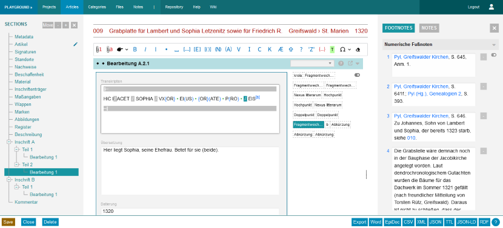

The frontend of Epigraf consists of HTML pages rendered by the CakePHP template system and styled with CSS.

For dynamic content, JavaScript is used to request HTML snippets from the server and update the page content.
Form handling is done with AJAX requests to the API using JSON data.
For interactive trees, tables and other widgets, Epigraf implements an own EpiWidJs framework that attaches JavaScript classes to HTML elements.

Bundling JavaScript files, CSS files, language resources and images is done using Webpack.
All bundles can be generated at once by calling `npm run build`.

