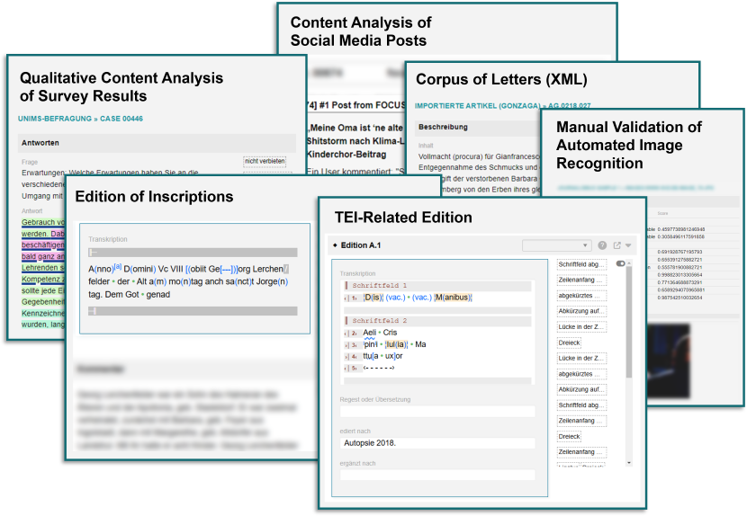

---
# Epigraf 5.0
#
# @author     Epigraf Team
# @contact    jakob.juenger@adwmainz.de
# @license    https://www.gnu.org/licenses/old-licenses/gpl-2.0.html GPL 2.0
#
# To modify the layout, see https://jekyllrb.com/docs/themes/#overriding-theme-defaults
title:
permalink: /
---

Epigraf is a research platform for collecting, annotating, linking and publishing multimodal text data.
The data model supports research databases ranging from epistolary editions to social media corpora.
Epigraf is currently used primarily for editing epigraphic data - inscriptions in connection with the objects to which they are attached.
It includes a publication system for various document formats such as Word or TEI, structured JSON, XML and CSV data, and triples in TTL, JSON-LD and RDF/XML.

- You want to know how Epigraf looks like and what it is good for?
  The [user documentation](/user/) provides an introduction to Epigraf,
  its configuration and administration.

- Epigraf is an open source project under active development.
  The [developer documentation](/devel/) guides you to installing Epigraf
  and provides an overview about the tech stack.
  The [Source code](https://github.com/digicademy/epigraf) is released on GitHub after major updates.
  We are open to collaborative development and appreciate getting in touch with you.

Epigraf emerged from the inter-academic edition project "The German Inscriptions of the Middle Ages and the Early Modern Period".
It is used in the nine inscription research centers of the six participating academies of sciences.
The application is being developed by the Digital Academy of Sciences and Literature \| Mainz and the Digital Media & Computational Methods Research Group at the University Münster.

