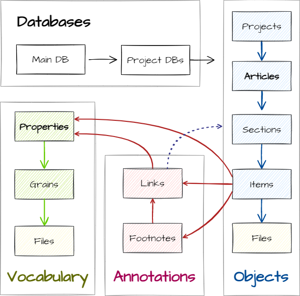

Epigraf maps documents in relational databases.
The **Relational Article Model (RAM)** of Epigraf fulfills a multitude of requirements for the flexible yet standardized modeling of research objects:

-   The structure of articles, sections and items maps documents without making assumptions about the meaning of the components. A section can represent images of monuments, letters or social media posts. It may contain metadata on the times, places and actors involved and metadata on the research process. The meaning of each component comes from the configuration of labels and relationships between the components.
-   Content is linked and annotated with vocabularies that are stored in a single table. Both open and controlled vocabularies can be used, and organized hierarchically or with cross-references as required. Categories can be kept consistent across heterogeneous and long-running projects. At the same time, they can be continuously expanded. The tabular structure provides easy-to-use filter, extraction and combination options for data analyses.
-    Data fields store simple data types, such as text, numbers, and references to entities (up to the level of annotated text segments) or file names. The Relational Article Model uses these data types to create abstractions of complex objects. Text fields with XML or JSON are used for deeper structuring, and multiple simple entities are combined to create composite data structures.
-   Each entity is identified via an IRI according to a defined scheme. This allows data to be compared and transferred between different databases. In addition, articles and categories can be enriched with authority data in order to link them to external vocabularies.

Relational databases and tabular structures are among the most widely used and robust systems for data storage. They can be easily migrated to new systems, scale well, have a high level of integrity and can be used with a variety of tools and packages. Document formats or graph data can be generated from relational databases using established standard technologies such as those implemented in Epigraf. Conversely, a large number of document-oriented data formats can be mapped to the Relational Article Model without information loss.

# The data model

The Relational Article Model (RAM) distinguishes between the data model and the domain model. The data model provides abstract elements for modeling texts and objects. It consists of the following components:

-   **Articles**: The analysed documents are referred to as articles.
-   **Sections**: Each article is made up of sections that can be flexibly combined. Sections contain the text, all relevant metadata, and associated files in their items.
-   **Items** include text, images, dating, geographic data, references to properties and structured formats such as XML and JSON.
-   **Annotations (including links and footnotes)** are used to markups text content. They carry additional attributes, comments or references to properties.
-   **Properties** are vocabularies or categories that are used for the structured description of a research object and for annotations.
-   **Projects** group several articles together.

# Domain model

The domain model provides meaning from a specific research field to the data model. It consists of one or multiple type configuration entities for each of the elements in the data model. For example, the domain model can be configured to create epigrahpic editions for inscriptions. Different section types are configured to compile transcriptions, images, or a critical commentary within an article. The following table shows examples from the domain of epigraphy.

<figure class="table">
    <table>
        <thead>
        <tr>
            <th>Table name</th>
            <th>Data model</th>
            <th>Domain model</th>
        </tr>
        </thead>
        <tbody>
        <tr>
            <td><strong>projects</strong></td>
            <td>...contain articles.</td>
            <td>As part of the "Die Deutschen Inschriften" project, a project is created for each volume covering a specific region of Germany.</td>
        </tr>
        <tr>
            <td><strong>articles</strong></td>
            <td>...contain data about the research object in their sections.</td>
            <td>There are two types of articles within the inscription project. Inscription articles contain the descriptions of the objects. Volume articles contain the introduction and other chapters of a volume.</td>
        </tr>
        <tr>
            <td><strong>sections</strong></td>
            <td>...provide structure to an article. Sections are ordered and arranged hierarchically. They contain content in their items.</td>
            <td>A section contains, for example, an object description, a transcription or images. Sections can be nested: inscription sections may contain inscription part sections, which finally contain editions of the inscription content.</td>
        </tr>
        <tr>
            <td><strong>items</strong></td>
            <td>...store the contents of a section, they are sorted and contain fields for data (texts, values...), references to properties and links to articles or other sections.</td>
            <td>The transcription text, literature references, locations, font types, text types or references to image files are stored in items. A section can include several items, such as multiple font types or multiple locations.</td>
        </tr>
        <tr>
            <td><strong>footnotes</strong></td>
            <td>...contain further information on a text segment. They are placed as tags in text fields, have a unique ID and footnote  content is stored in the footnotes table of the database.</td>
            <td>In the inscriptions project, the text-critical apparatus and general annotations are modeled as footnotes.</td>
        </tr>
        <tr>
            <td><strong>links</strong></td>
            <td>...are used to link text segments or tags to properties or to refer to articles and sections. The tags are uniquely identified and references are stored in the links table of the database.</td>
            <td>Link annotations are used for references to the literature within the commentary or to assign categories to word separators (whether it is a cross, a flow, a dot) in a transcription.</td>
        </tr>
        <tr>
            <td><strong>properties</strong></td>
            <td>...contain categories and vocabularies that are used for structured annotation. Properties are sorted and organized hierarchically. They can be used either directly in items or connected to text segments via links.</td>
            <td>Some properties are directly referenced in an article item, for example locations and object types. Other properties are used to mark up text segments, such as the type of a word separator.</td>
        </tr>
        <tr>
            <td><strong>files</strong></td>
            <td>...mirror the file system on the server in order to store file and folder names and some metadata in the database.</td>
            <td>Images of inscription objects are stored as files on the server.</td>
        </tr>
        </tbody>
    </table>
</figure>

How the data model is mapped to the domain model is defined in the [types configuration](../configuration).
